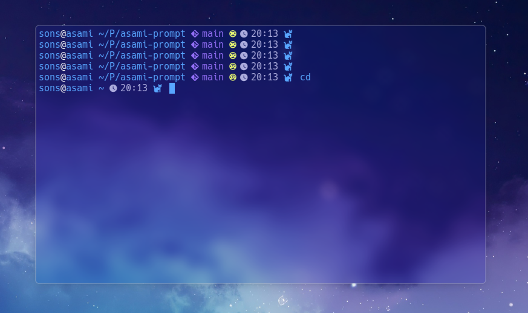

# 🐟 Fish Configuration

A minimal, fast and modern configuration for the Fish shell.

<p align="center">
  
  
  
</p>

## ✨ Features

* 🐟 Minimal custom Fish prompt
* 🌿 Git branch indicator
* 🦀 Automatic project language detection
* 🕒 Current time in the prompt
* 🎨 Clean syntax highlighting
* ⌨️ Vim keybindings
* 📁 Smart PATH management
* 🔍 FZF integration
* 🚀 Zoxide integration
* 🐱 Nerd Font icons

## 📂 Structure

```text
fish-asami/
├── completions/
├── conf.d/
├── functions/
│   ├── fish_prompt.fish
│   ├── __git_branch.fish
│   └── __project_icon.fish
├── aliases.fish
├── colors.fish
├── cursor.fish
├── env.fish
├── paths.fish
└── config.fish
```

## 📦 Requirements

* Fish Shell
* Nerd Font (Hack Nerd Font recommended)
* lsd
* bat
* ripgrep
* fd
* fzf
* zoxide

## 🚀 Installation

Clone the repository:

```bash
git clone https://github.com/asamiwr/fish-asami.git
```

Copy or symlink the files into your Fish configuration directory:

```bash
cp -r fish-asami/* ~/.config/fish/
```


Restart Fish or reload the configuration:

```fish
source ~/.config/fish/config.fish
```

## 📸 Preview

<p align="center">
  
</p>

## ❤️ Philosophy

This configuration aims to be:

* Minimal
* Fast
* Readable
* Easy to extend
* Free of unnecessary plugins

## 📄 License

This project is licensed under the MIT License.
